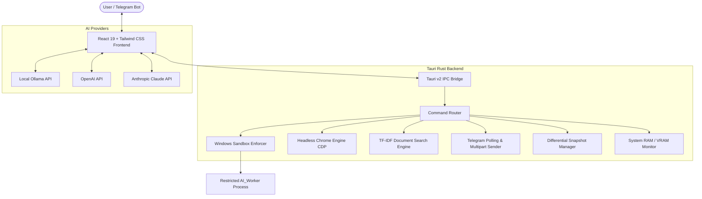

# 🛡️ AI Sandbox Desktop

<div align="center">


**An autonomous, sandboxed AI desktop environment for safe agentic code execution, true browser automation, multimodal vision, and local RAG.**

[📥 Download Desktop App](#-download--installation) • [✨ Key Features](#-key-features) • [🏗️ Architecture](#️-architecture) • [🚀 Quickstart](#-quickstart--local-development) • [📖 Tool Reference](#-built-in-agentic-tools)

</div>

---

## 🌟 Overview

**AI Sandbox Desktop** is a high-performance, security-focused agentic AI desktop application built with **Tauri v2**, **Rust**, and **React 19**. It allows local and cloud LLMs (Ollama, OpenAI, Anthropic) to execute complex, multi-step workflows—such as writing files, executing PowerShell scripts, browsing the live web, analyzing images, and performing semantic document search—inside a strictly isolated and sandboxed Windows execution boundary.

---

## ✨ Key Features

### 🛡️ Dual-Privilege Windows Sandbox
- **Process Isolation**: Executes shell and script commands under a dedicated restricted Windows worker account (`AI_Worker`) using `CreateProcessWithLogonW`.
- **Workspace Boundary Enforcement**: Prevents accidental or malicious modification outside the configured project workspaces.
- **Terminal Bridge**: Real-time terminal output streaming with colorized logs and status indicators.

### 🧠 Multi-Provider AI Engine
- **Local LLM Support (Ollama)**: Zero-latency, offline execution with models like `Qwen 2.5`, `Llama 3.3`, `Gemma 2`, `DeepSeek R1`, and more.
- **Cloud LLM Support**: Native streaming integration for **OpenAI** (GPT-4o, o3-mini) and **Anthropic** (Claude 3.5 / 3.7 Sonnet).
- **Auto Context Management**: Dynamic context compression and token monitoring with capability badges (Vision, Tools, Thinking, Context Window).

### 🌐 True Browser Automation
- Embedded headless Chromium via Chrome DevTools Protocol (`CDP`).
- Real-time webpage navigation, DOM text extraction, UI element clicking, typing, and full-resolution screenshot capture directly returned into the AI's vision stream.

### 📄 Local Vector RAG (Retrieval-Augmented Generation)
- Instant semantic document querying and paragraph extraction for PDFs, source code, and large markdown files without sending document contents to external servers.

### 👁️ Multimodal Vision Pipeline
- Seamless image reading (`.png`, `.jpg`, `.webp`, `.svg`) with base64 transcoding and injection into multimodal LLM context windows.

### 📲 Remote Telegram Control & File Delivery
- Built-in Telegram Bot polling system allowing bidirectional chat, remote prompt execution, and direct dispatch of generated PDFs, slides, and files straight to your phone.

### ⏪ Time-Travel Snapshots & Memory (The Brain)
- **Automatic Pre-Modification Backups**: Creates differential snapshots before file writes so you can undo any AI action with a single click.
- **Persistent Knowledge Graph**: Persistent long-term memory (`<remember>`) stored directly in `.gemini/brain` or workspace storage.
- **Live Telemetry & Resource Gauge**: Real-time monitoring of system RAM, GPU VRAM, and agent reasoning traces.

---

## 🏗️ Architecture



---

## 📥 Download & Installation

### Option 1: Pre-Built Desktop Installers
Download the latest Windows installer (`.msi` or setup `.exe`) from the [Releases](https://github.com/Mandeep-Thapa/ai-sandbox-app/releases) tab.

1. Download `ai-sandbox-app_0.1.0_x64_en-US.msi` or `setup.exe`.
2. Run the installer and follow the on-screen setup prompts.
3. Launch **AI Sandbox** from your Start Menu or Desktop shortcut.

### Option 2: Build from Source
Ensure you have the prerequisites installed:
- [Node.js](https://nodejs.org/) (v18 or higher)
- [Rust](https://www.rust-lang.org/tools/install) (1.80+)
- [C++ Build Tools](https://visualstudio.microsoft.com/visual-cpp-build-tools/) (for Windows MSVC)
- [Ollama](https://ollama.com/) (optional, for local LLMs)

```bash
# 1. Clone the repository
git clone https://github.com/Mandeep-Thapa/ai-sandbox-app.git
cd ai-sandbox-app

# 2. Install frontend dependencies
npm install

# 3. Build production bundle and installer
npm run tauri build
```
The compiled installer will be located in:
`src-tauri/target/release/bundle/msi/` and `src-tauri/target/release/bundle/nsis/`

---

## 🚀 Quickstart / Local Development

Run the live development environment with hot-reloading:

```bash
# Start Vite + Tauri Dev Server
npm run tauri dev
```

---

## 📖 Built-in Agentic Tools

The model interacts with the environment through high-precision XML tags:

| Tool Tag | Description | Example |
| :--- | :--- | :--- |
| `<execute_command>` | Runs a sandboxed PowerShell command in the workspace | `<execute_command>npm run build</execute_command>` |
| `<write_file>` | Writes or overwrites a file inside the workspace | `<write_file path="src/index.ts">console.log('hi')</write_file>` |
| `<read_file>` | Reads the complete contents of a text or code file | `<read_file path="src/index.ts" />` |
| `<list_dir>` | Lists files and directories within a given workspace folder | `<list_dir path="src" />` |
| `<browse_web>` | Automates Chromium navigation, scraping, and screenshots | `<browse_web action="screenshot_base64" url="https://google.com" />` |
| `<search_document>`| Local vector/RAG search across large PDF or text documents | `<search_document path="docs/manual.pdf" query="API endpoints" />` |
| `<read_image>` | Encodes an image to Base64 and injects into vision context | `<read_image path="screenshot.png" />` |
| `<send_file>` | Sends a generated file to the user via Telegram | `<send_file path="report.pdf" />` |
| `<remember>` | Saves crucial context into the persistent Brain memory | `<remember>User prefers TypeScript with strict mode</remember>` |
| `<search_web>` | Searches DuckDuckGo for live web documentation and news | `<search_web query="Tauri v2 migration guide" />` |

---

## ⚙️ Configuration & Security

1. **Workspace Boundary**: Set your root project directory in the UI settings or top navigation bar. All file operations outside this path are blocked by default.
2. **Restricted Windows User**: Configure the `AI_Worker` credentials in the Sandbox Settings tab to run subprocesses with low Windows privileges.
3. **Telegram Setup**: Provide your Telegram Bot Token in Settings -> Telegram. Once you message your bot `/start`, the desktop app automatically binds to your chat ID.

---

## 🛠️ Tech Stack

- **Frontend**: React 19, TypeScript, Tailwind CSS v4, Lucide Icons, React Markdown, Remark GFM
- **Desktop Runtime**: Tauri v2
- **Backend / Core Engine**: Rust, Win32 API (`windows-rs`), `headless_chrome`, `pdf-extract`, `ureq`, `base64`, `sysinfo`
- **Build Tooling**: Vite 7, Cargo

---

## 📄 License

This project is licensed under the [MIT License](LICENSE).
